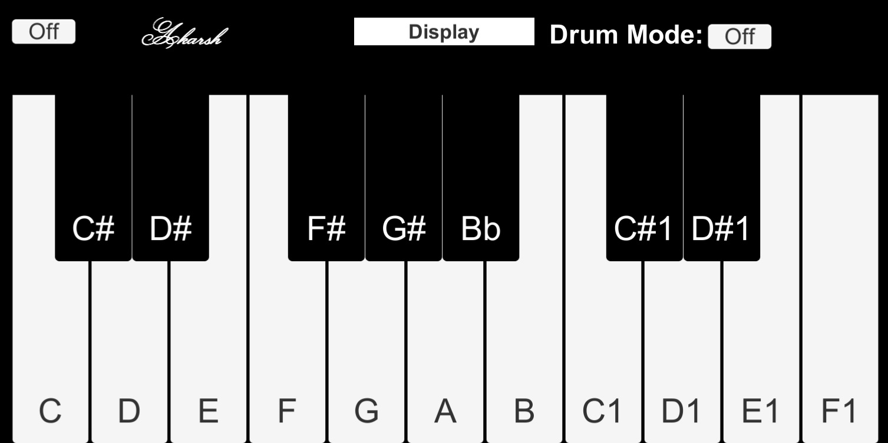

# Pocket Piano

Pocket Piano is a lightweight and portable virtual piano application designed for music enthusiasts. With a user-friendly interface and responsive keys, it allows you to practice, compose, and play your favorite tunes anytime, anywhere!

## Features

- **Responsive Virtual Piano Keys**: Enjoy a realistic piano-playing experience.
- **Multiple Octaves**: Access a range of notes for versatile compositions.
- **Simple Interface**: Easy-to-use controls suitable for beginners.
- **Portable and Lightweight**: Designed for on-the-go music.

## Installation

1. Clone the repository:
   ```bash
   git clone https://github.com/your-username/pocket-piano.git
   ```
2. Navigate to the project directory:
   ```bash
   cd pocket-piano
   ```
3. Follow the build instructions (specific to your platform or framework).

## Usage

1. Open the application on your device.
2. Use your touch input to play notes.
3. Explore different settings and features to customize your experience.

## Screenshots



*(This image showcases the virtual piano interface created using Unity and C#.)*

## Technologies Used

- Programming Language/Framework: Unity (C#)

## Contributing

Contributions are welcome! If you'd like to improve Pocket Piano, please follow these steps:

1. Fork the repository.
2. Create a new branch:
   ```bash
   git checkout -b feature-name
   ```
3. Commit your changes:
   ```bash
   git commit -m "Add your message here"
   ```
4. Push to the branch:
   ```bash
   git push origin feature-name
   ```
5. Open a pull request.

## License

This project is licensed under the MIT License. See the `LICENSE` file for more details.

## Contact

For questions or suggestions, feel free to reach out:
- **Email**: sinhaakarsh64@gmail.com

---

Enjoy making music with Pocket Piano!
